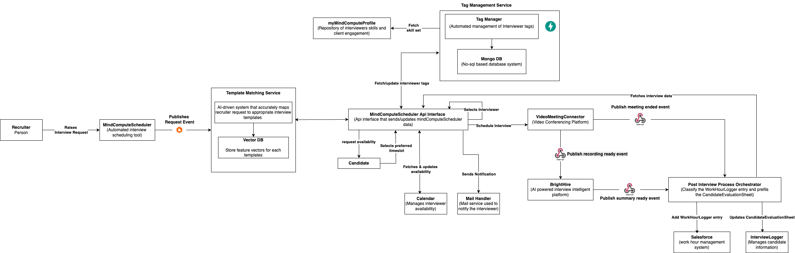

# AI Powered Interview Scheduler By Trio Trouble

## Table of Contents

- [Introduction](#introduction)
- [Team Members](#team-members)
- [User Research Findings](#user-research-findings)
- [Requirements](#requirements)
- [Business Metrics and Success Criteria](#business-metrics-and-success-criteria)
- [Features and Roadmap](#features-and-roadmap)
- [Architecture Solution Overview](#architecture-solution-overview)
- [Critical Architectural Characteristics](#critical-architectural-characteristics)
- [Technology Stack Justification](#technology-stack-justification)
- [Deployment Architecture](#deployment-architecture)
- [Integration Testing Strategy](#integration-testing-strategy)
- [Implementation Approach](#implementation-approach)
- [Architecture Decision Records (ADRs)](#architecture-decision-records-adrs)
- [Team Topologies](#team-topologies)

## Introduction
MindCompute faces significant challenges efficiently scheduling technical interviews, with manual processes creating bottlenecks in the hiring pipeline. Our solution automates and enhances the interview scheduling process through:

1. AI-powered matching between candidates and interviewers
2. Intelligent automation of manual scheduling tasks
3. Seamless integration with existing systems (InterviewLogger, MindComputeScheduler, calendars)
4. Enhanced visibility and analytics for all stakeholders

This architecture addresses critical pain points identified through stakeholder interviews while leveraging existing tools and infrastructure.

## Existing System Context and Enhancement Approach

### Current System Capabilities

MindCompute recently migrated to MindComputeScheduler as its interview scheduling platform. MindComputeScheduler is already a robust solution with significant capabilities:

- **Rich Integration Ecosystem**:
   - Calendar API for real-time availability management
   - MailHandler integration for automated communications
   - LeavePlanner integration for interviewer availability
   - InterviewLogger ATS integration for candidate data

- **Existing Automation Features**:
   - Intelligent interviewer matching based on tags
   - Curated persona templates for interviewer and interviewee
   - Automated scheduling based on availability
   - Built-in tag management system for skill identification
   - Interview analytics dashboards
   - Automated event creation and notifications
   - Automated interview rescheduling capibilities given an interview declined

- **Industry Adoption**: MindComputeScheduler is widely adopted in the industry as a leading interview scheduling solution

### Enhancement vs. Replacement Rationale

Our stakeholder interviews revealed that while MindComputeScheduler provides a solid foundation, there are specific pain points and inefficiencies in the current workflow. Our architectural approach deliberately avoids a disruptive "rip and replace" strategy for several compelling reasons:

1. **Recent Migration Investment**: MindCompute has recently invested significant resources in migrating from  TalentFitAssessorto MindComputeScheduler. Abandoning this investment would be cost-prohibitive and disruptive.

2. **Adoption Curve Considerations**: Users are still adapting to MindComputeScheduler, and introducing an entirely new system would create unnecessary change management challenges.

3. **Targeted Efficiency Gaps**: Our user research identified specific bottlenecks that can be addressed through targeted enhancements rather than wholesale replacement:
   - Manual interview template selection and configuration
   - Outdated interviewer tags and skills information
   - Limited intelligence in matching algorithms
   - Administrative overhead for interviewers
   - Limited interviewer pool

4. **Ecosystem Leverage**: By building on MindComputeScheduler's existing integrations with InterviewLogger, Calendar, and other systems, we can deliver value faster while minimizing integration complexity.

5. **Complementary Technology Landscape**: Other tools like BrightHire are already effectively handling interview recording and summarization. Our solution complements these existing tools rather than competing with them.

### Enhancement Strategy

Based on this context, our architecture focuses on:

1. **Extending MindComputeScheduler's Core Capabilities**: Adding intelligence and automation where the platform currently lacks it
2. **Bridging Integration Gaps**: Connecting systems that don't currently talk to each other
3. **Adding AI Intelligence**: Introducing AI agents to optimize matching, classification, and decision-making
4. **Process Automation**: Eliminating manual steps while preserving the overall workflow

This approach allows us to deliver immediate value by addressing the most critical pain points while respecting the organization's recent investment in MindComputeScheduler and minimizing disruption to users.

## Team

-  **[Varshini Mohanasundaram](https://www.linkedin.com/in/varshini-mohanasundaram)** - Engineer
-  **[Vignesh Rajkumar](https://www.linkedin.com/in/vigneshrajkumar)** - Senior Engineer
-  **[Birlla Packiasamy](https://www.linkedin.com/in/birllapackiasamy)** - Lead Engineer

## User Research Findings

We conducted structured interviews with key stakeholders to thoroughly understand the current interview scheduling process and identify critical pain points:

### Process Overview
The current interview scheduling at MindCompute involves four primary stakeholders across multiple systems:
- **Recruiters** initiate the process through InterviewLogger and define requirements
- **Talent Operations** coordinate scheduling through MindComputeScheduler templates and panel selection
- **Interviewers** conduct technical assessments and provide feedback
- **Candidates** select available time slots and participate in interviews

### Primary Pain Points

1. **Extended Scheduling Timeline**
   - Talent Operations requires 2-3 days to schedule interviews after receiving requests
   - Manual coordination creates bottlenecks, particularly when rescheduling is needed
   - Limited visibility into scheduling progress for recruiters and candidates
   - Communication gaps between recruiter and talent ops

2. **Interviewer Matching Challenges**
   - Skill tags in MindComputeScheduler often outdated or misaligned with actual expertise
   - Limited mechanisms to verify interviewer qualifications
   - Manual template selection process prone to errors
   - MindComputeScheduler automation sometimes selects inappropriate interviewers

3. **Availability & Scheduling Conflicts**
   - Limited panel availability
   - High decline rate 
   - Rescheduling process requires significant manual coordination

4. **Administrative Burden**
   - Interviewers spend considerable time on  CandidateEvaluationSheet completion
   - Talent Operations team stretched thin across multiple recruiters
   - Limited recognition or incentives for active interviewers
   - No defined process to identify new interviewers

5. **System Integration Gaps**
   - Limited scheduling strategies between in identifying calendar slots
   - Manual feedback transfer between systems
   - Lack of unified analytics across the interview process
   - Interviewers often misses WorkHourLogger entries

These findings directly informed our requirements and feature prioritization, ensuring our solution addresses the most impactful pain points for all stakeholders.
For detailed persona journeys, please refer the below links:
- [Candidate](UserJourneys/sequence_diagram.png)
- [Recruiter](UserJourneys/recruiter_user_journey.png)
- [Talent Operations](UserJourneys/talent_ops_user_journey.png)
- [Interviewer](UserJourneys/UserJourneyExample.png)

## Requirements

To achieve effective requirement identification, we employed a collaborative approach involving job candidate, recruiter, talent ops associate,
interviewer, to bring a different viewpoint to the table, helping us explore all dimensions of the hiring process from user
experience to technical feasibility. Through workshops, we gathered insights and identified pain points in the current
hiring processes.

The requirements are detailed in the following
sections: 
 - [Functional Requirements](Requirements/FunctionalRequirements.md)  
 - [Non-Functional Requirements](Requirements/NonFunctionalRequirements.md)


## Business Metrics and Success Criteria

To ensure our solution delivers measurable business value, we've established specific success criteria across four key dimensions: efficiency, engagement, quality, and cost. These metrics will guide our design decisions and help stakeholders evaluate the impact of the implemented system.

### Efficiency Metrics
| Metric | Target | Current State | Measurement Approach |
|--------|--------|--------------|---------------------|
| Interview scheduling time | 50% reduction | Currently 2-3 days | Time from request to confirmation |
| Interview decline rate | 40% reduction | Currently approximately 4 out of 10 | Percentage of declined interviews |

### Engagement Metrics
| Metric | Target | Current State | Measurement Approach |
|--------|--------|--------------|---------------------|
| Interviewer participation | 25% increase | X active interviewers | Number of active interviewers monthly |
| Interviewer recognition | 70% satisfaction | Limited recognition | Surveyed satisfaction with recognition |

### Quality Metrics
| Metric | Target | Current State | Measurement Approach |
|--------|--------|--------------|---------------------|
| Interviewer-skill match accuracy | 90% match rate | Not currently measured | Post-interview feedback analysis |
| Template selection accuracy | 95% correct selection | Requires manual verification | Reduction in template changes |

### Cost Metrics
| Metric | Target | Current State | Measurement Approach |
|--------|--------|--------------|---------------------|
| Talent Operations time savings | 40% reduction | Full-time coordination | Hours spent on scheduling tasks |
| Interview rescheduling rate | 30% reduction | High reschedule frequency | Percentage of rescheduled interviews |

These metrics align directly with our proposed features and will be tracked throughout implementation to ensure we're delivering value in each phase of the project. Each metric has been selected based on stakeholder input and identified pain points in the current process.

## Features and Roadmap

### Prioritization Framework

To ensure we're delivering the most impactful features first, we employed the RICE prioritization framework (Reach, Impact, Confidence, Effort) to evaluate and rank potential features. This data-driven approach helped us balance immediate pain points with long-term strategic improvements.

Our analysis revealed several critical bottlenecks in the current process:

1. **Extended Scheduling Timeline**: Talent Operations currently requires 2-3 days to schedule interviews after receiving requests from recruiters, significantly extending the hiring timeline.

2. **Limited Interviewer Pool**: The available pool of interviewers for specific skills and interview types is often constrained, leading to scheduling conflicts and delays.

3. **Manual Tag Management**: The process of assigning and updating interviewer tags (skills, preferences, etc.) is largely manual, leading to outdated information and suboptimal matching.

4. **Time-consuming Administrative Tasks**: Interviewers spend valuable time on administrative tasks like WorkHourLogger entries and  CandidateEvaluationSheet completion rather than conducting interviews.

5. **High Interview Cancellation Rate**: Interviews are frequently cancelled by interviewers, primarily due to incorrect information leading to inappropriate panel selection. This creates rescheduling work and extends hiring timelines.

### Feature Roadmap

Based on our RICE analysis, we've developed a phased roadmap to address these challenges:

#### Phase 1: Foundation and Quick Wins (1-6 months)

| Feature | Description | Priority |
|---------|-------------|----------|
| AI-Powered Template Matching | Implement natural language processing to automatically identify and apply appropriate interview templates based on recruiter requests | High |
| Automated Tag Management | Develop a system to periodically update interviewer tags based on project assignments and skills from MyMindComputeProfile | High |
| Automated WorkHourLogger Integration | Automatically populate WorkHourLogger entries when interviews are completed | Medium |
| Automated  CandidateEvaluationSheet Generation | Pre-populate interview CandidateEvaluationSheets based on interview type and candidate profile | Medium |

#### Phase 2: Advanced Features and Optimization (7-12 months)

| Feature | Description | Priority |
|---------|-------------|----------|
| Interviewer Leaderboards | Implement gamification elements to recognize and incentivize active interviewers | Low |
| Predictive Scheduling | Use machine learning to predict optimal interview times based on historical patterns | Medium |
| Automatic Comp-Off Allocation | Automatically add leave days for interviews conducted outside regular hours | Medium |
| Advanced Analytics Dashboard | Provide comprehensive insights into the interview process, bottlenecks, and performance metrics | High |
| Cancellation Prediction | ML model to identify potential cancellation risks before they occur and suggest preventive actions | Medium |
| Pre-Interview Confirmation System | Automated system to confirm interviewer availability and readiness 24 hours before scheduled interviews | High |
| Calendar Synchronization | Implement bidirectional sync with client calendars to accurately reflect interviewer availability | Medium |
| Interviewer Preference Setting | Create an intuitive interface for interviewers to set and update their preferences for interview types, tech stacks, and availability | Medium |

## Feature-Impact Matrix

| Feature | Timeline<br>Reduction | Interviewer<br>Pool | Admin<br>Efficiency | User<br>Experience | Cancellation<br>Reduction |
|---------|:----:|:----:|:----:|:----:|:----:|
| AI Template Matching | ●●● |  | ●● | ●● |  |
| Tag Assignment | ● | ●●● |  |  | ●● |
| Preference Setting |  | ●●● |  | ●●● |  |
| WorkHourLogger Integration |  |  | ●●● | ● |  |
|  CandidateEvaluationSheet Integration | ●● |  | ●●● | ●● |  |
| [Additional features] | ... | ... | ... | ... | ... |

#### Legend:
●●● Strong impact ●● Medium impact  ● Light impact

Our feature roadmap directly addresses the current pain points in the interview scheduling process:

By implementing these features according to our phased approach, we expect to transform the interview scheduling process from a manual, time-consuming activity into an efficient, automated system that enhances the experience for all stakeholders while significantly reducing the time-to-hire.

## Architecture Solution Overview

Our solution leverages MindComputeScheduler as the central platform while enhancing its capabilities through extensions, integrations, and AI augmentation. Rather than building a new system, we'll focus on addressing specific gaps and pain points within the existing ecosystem.

### Assumptions

1. MyMindComputeProfile API is available and provides interviewer profile along with skill set
2. VideoMeetingConnector has webhooks for event triggering
3. MindComputeScheduler and InterviewLogger are already integrated
4. InterviewLogger has API exposed to update  CandidateEvaluationSheet
5. Salesforce has API exposed to update WorkHourLogger code for interview
6. Talent ops has tags and templates inplace
7. NLP trained model to identify templates
8. MindComputeScheduler can publish events and is available for consumption
9. MindComputeScheduler is already integrated with VideoMeetingConnector, calendar, MailHandler and Messenger
10. MindComputeScheduler has API exposed to fetch tag and template details

### Solution Approach

## Context Diagram


## System Overview Diagram


## Architecture Diagram


Our architecture focuses on three key enhancement areas:

1. **MindComputeScheduler Extensions**: Custom functionality built on top of MindComputeScheduler's API to enhance its capabilities

2. **AI Enhancement Layer**: Intelligent services that augment MindComputeScheduler's matching and scheduling capabilities

3. **Process Automation**: Workflow automation to reduce manual intervention and streamline the end-to-end process

## Key Solution Components

### 1. Intelligent Template Processing Service

#### Service Overview

The Template Processing Service is defined as a **standalone microservice** with a clear boundary, responsible for automating the template selection process. This service:

- Receives and processes events from MindComputeScheduler via a dedicated event handler
- Orchestrates multiple internal components to analyze requests and match templates
- Provides consistent error handling, retry logic, and transaction management
- Exposes API endpoints for synchronous operations when needed

<div align="center" style="text-align: center;">
    
</div>

#### Architecture Components

The architecture contains these primary components:

#### 2.1 Template Processing Service

A self-contained microservice with the following components:

1. **Event Handler**
    - Subscribes to relevant topics on the EventBus
    - Processes incoming events from MindComputeScheduler
    - Routes events to appropriate internal components
    - Implements retry policies and dead-letter queues for failed events

2. **Orchestration Layer**
    - Coordinates workflow between internal components
    - Maintains transaction boundaries
    - Implements circuit breakers for external service calls
    - Manages compensating transactions for failures

3. **Core Components**
    - **Request Analyzer**: Extracts entities from requests using NLP
    - **Template Matcher**: Matches analyzed requests to appropriate templates
    - **Learning Engine**: Improves matching through feedback and outcomes

4. **Data Access Layer**
    - Manages connections to persistent storage
    - Interfaces with Vector DB for embeddings storage
    - Handles caching of frequently accessed data

#### External Systems Integration

1. **MindComputeScheduler Integration**
    - Well-defined API contract for MindComputeScheduler communication
    - Dedicated client library with resilience patterns
    - Versioned interfaces to accommodate changes

2. **Event Bus**
    - Message broker (e.g., Kafka, RabbitMQ) for event-based communication
    - Defined event schemas and topics
    - Monitoring for queue depths and processing failures

#### Event Flow

The event flow is clarified as follows:

1. Recruiter creates interview request in MindComputeScheduler
2. MindComputeScheduler publishes event to EventBus on a defined topic
3. **Template Processing Service's Event Handler** subscribes to and receives the event
4. Event Handler validates event and initiates processing workflow
5. Orchestration Layer coordinates:
    - Request Analyzer processing
    - Template Matcher operations
    - Learning Engine feedback collection
6. Service sends template selection back to MindComputeScheduler via API call
7. Sends notification to relevant parties

#### Sequence Diagram
```mermaid
%%{
  init: {
    'theme': 'base '
  }
}%%
sequenceDiagram
    participant Recruiter
    participant MindComputeScheduler
    participant EventBus
    participant TPService as Template Processing Service
    participant ReqAnalyzer as Request Analyzer
    participant TempMatcher as Template Matcher
    participant LearnEngine as Learning Engine
    participant VectorDB

    Recruiter->>MindComputeScheduler: Create interview request
    MindComputeScheduler->>EventBus: Publish request event
    EventBus->>TPService: Event Handler receives event

    TPService->>TPService: Validate event & start workflow
    TPService->>MindComputeScheduler: Fetch additional request details (if needed)
    MindComputeScheduler->>TPService: Return request data

    TPService->>ReqAnalyzer: Process request with NLP
    ReqAnalyzer->>VectorDB: Store/retrieve embeddings
    VectorDB->>ReqAnalyzer: Return relevant vectors
    ReqAnalyzer->>TPService: Return analyzed request

    alt Confidence Below Threshold
        TPService->>MindComputeScheduler: Flag for human review
        MindComputeScheduler->>Recruiter: Request clarification
        Recruiter->>MindComputeScheduler: Provide additional details
        MindComputeScheduler->>EventBus: Publish updated request
        EventBus->>TPService: Process updated request
    end

    TPService->>TempMatcher: Send analyzed request
    TempMatcher->>MindComputeScheduler: Query available templates
    MindComputeScheduler->>TempMatcher: Return template catalog
    TempMatcher->>TPService: Return matched template

    TPService->>MindComputeScheduler: Apply template selection
    MindComputeScheduler->>MindComputeScheduler: Run interviewer matching
    MindComputeScheduler->>Recruiter: Notify template selection

    MindComputeScheduler->>EventBus: Publish interview outcome
    EventBus->>TPService: Receive outcome event
    TPService->>LearnEngine: Process feedback data
    LearnEngine->>LearnEngine: Update matching models
   ```

#### Advanced Capabilities

1. **Technical Skill Extraction**
    - Domain-specific NER models trained on technical taxonomy
    - Normalization of skill variations and abbreviations
    - Skill relationship modeling (e.g., JavaScript → React → Redux)
    - Confidence scoring for extracted entities

2. **Semantic Understanding**
    - Vector embeddings to capture meaning beyond keywords
    - Context-aware interpretation of requirements
    - Handling of technical jargon and MindCompute-specific terminology
    - Disambiguation of ambiguous skills or requirements

3. **Learning and Adaptation**
    - Continuous model refinement based on outcomes
    - A/B testing framework for algorithm improvements
    - Explicit and implicit feedback incorporation
    - Handling of evolving skills and interview practices

4. **Edge Case Handling**
    - Role types with limited historical data
    - Conflicting or ambiguous requirements
    - Multiple equally valid template options
    - Low confidence scenarios requiring human review

### 2. Post-Interview Process Orchestrator (PIPO)

#### Service Overview

The Post-Interview Process Orchestrator (PIPO) is a platform service that provides end-to-end automation for post-interview administrative processes. It operates as a managed service with multiple coordinated components deployed as a cohesive unit, while exposing well-defined integration points for external systems.

PIPO automates WorkHourLogger filing and  CandidateEvaluationSheet submission to eliminate administrative overhead for interviewers. Using event-driven architecture and AI-powered processing, PIPO automatically captures interview metadata from VideoMeetingConnector meetings, enriches it with context from BrightHire and MindComputeScheduler, and creates accurate WorkHourLogger entries and pre-fill CandidateEvaluationSheets in related systems.


#### Problem Statement

Interviewers currently spend 10-15 minutes per interview on administrative tasks:
- Manually recording time in Salesforce
- Completing CandidateEvaluationSheets in InterviewLogger

These manual processes result in:
 - 10-15 minutes of administrative overhead per interview
 - Delayed or incomplete feedback affecting hiring decisions
 - Inconsistent WorkHourLogger compliance
 - Reduced interviewer availability and satisfaction

#### Architectural Decision Records (ADRs)
- [ADR 9](ADRs/ADR9.md): Event-Driven Architecture for PIPO
- [ADR 10](ADRs/ADR10.md): AI-Enhanced Document Processing
- [ADR 11](ADRs/ADR11.md): Single-Region Containerized Deployment

#### Component Architecture

1. **Event Ingestion Layer**
   - **Webhook Receiver Service**: Securely receives webhooks from VideoMeetingConnector, BrightHire, and MindComputeScheduler
   - Performs signature validation and initial event classification
   - Implemented using FastAPI

2. **Event Processing Core**
   - **Event Correlation Engine**: Aggregates related events into complete context
   - **Documentation Processing Service**: Transforms event data into WorkHourLoggers and CandidateEvaluationSheets
   - Implemented as scalable microservices with MongoDB for state management

3. **AI Enhancement Layer** 
   - **Classification Agent**: Determines WorkHourLogger categories and eligibility for compensation time
   - **Content Analysis Agent**: Analyzes interview content for  CandidateEvaluationSheet generation
   - Implemented using TensorFlow with domain-specific models

4. **Integration Adapters**
   - **Salesforce Adapter**: Creates WorkHourLogger entries with appropriate project codes
   - **InterviewLogger Adapter**: Submits CandidateEvaluationSheets with interview assessments
   - **Notification Adapter**: Provides status updates to relevant stakeholders

#### Technical Implementation

**Technology Stack**

| Component | Technology | Rationale |
|-----------|------------|-----------|
| API Layer | FastAPI | Asynchronous processing, performance |
| Event Bus | RabbitMQ | Durability, ordering, scaling |
| Data Store | MongoDB | Flexibility for event data |
| AI Platform | TensorFlow | Model versioning, inference scaling |
| Infrastructure | Kubernetes | Container orchestration, resilience |
| Monitoring | Prometheus/Grafana | Metrics, visualization, alerting |

#### Data Flow

```mermaid
sequenceDiagram
   participant VideoMeetingConnector as VideoMeetingConnector Server
   participant BH as BrightHire
   participant WR as Webhook Receiver
   participant EQ as Event Queue
   participant CE as Correlation Engine
   participant DP as Documentation Processor
   participant AI as AI Agents
   participant SA as Salesforce Adapter
   participant GA as InterviewLogger Adapter
   participant NA as Notification Adapter

   Note over VideoMeetingConnector: Interview Ends
   VideoMeetingConnector->>WR: meeting.ended webhook
   activate WR
   WR->>WR: Validate signature
   WR->>EQ: Publish MeetingEnded event
   WR-->>VideoMeetingConnector: 200 OK
   deactivate WR

   Note over VideoMeetingConnector: Recording Available
   VideoMeetingConnector->>WR: recording.completed webhook
   activate WR
   WR->>WR: Validate signature
   WR->>EQ: Publish RecordingCompleted event
   WR-->>VideoMeetingConnector: 200 OK
   deactivate WR

   Note over BH: Recording Processed
   BH->>WR: recording.processed webhook
   activate WR
   WR->>WR: Validate signature
   WR->>EQ: Publish RecordingProcessed event
   WR-->>BH: 200 OK
   deactivate WR

   Note over BH: Interview Summary Generated
   BH->>WR: summary.completed webhook
   activate WR
   WR->>WR: Validate signature
   WR->>EQ: Publish SummaryCompleted event
   WR-->>BH: 200 OK
   deactivate WR

   EQ->>CE: Consume MeetingEnded event
   activate CE
   CE->>CE: Store event data
   deactivate CE

   EQ->>CE: Consume RecordingCompleted event
   activate CE
   CE->>CE: Find related meeting event
   CE->>CE: Update correlation data
   deactivate CE

   EQ->>CE: Consume RecordingProcessed event
   activate CE
   CE->>CE: Find related correlation
   CE->>CE: Update correlation data
   deactivate CE

   EQ->>CE: Consume SummaryCompleted event
   activate CE
   CE->>CE: Find related correlation
   CE->>CE: Complete correlation
   CE->>DP: Send complete context
   deactivate CE

   activate DP
   DP->>BH: Request interview summary data
   activate BH
   BH-->>DP: Return interview summary
   deactivate BH

   DP->>AI: Request documentation classification
   activate AI
   AI->>AI: Classify WorkHourLogger category
   AI->>AI: Analyze  CandidateEvaluationSheet content
   AI-->>DP: Return classified data
   deactivate AI

   DP->>SA: Create WorkHourLogger entry
   activate SA
   SA-->>DP: Confirm WorkHourLogger creation
   deactivate SA

   DP->>GA: Submit  CandidateEvaluationSheet with summary
   activate GA
   GA-->>DP: Confirm  CandidateEvaluationSheet submission
   deactivate GA

   DP->>NA: Send completion notification
   activate NA
   NA-->>DP: Confirm notification sent
   deactivate NA

   DP->>DP: Record completion status
   deactivate DP

   Note over DP: Process Complete
```

#### Technical Implementation Options

We've selected a **Containerized Microservice with Message Queue** approach for our PIPO implementation after evaluating multiple options. This approach provides the optimal balance of performance, control, and flexibility for our WorkHourLogger integration needs.

[View the complete Architecture Decision Record](./ADRs/ADR16.md)

#### Key Performance Indicators

| KPI | Target | Measurement Method |
|-----|--------|-------------------|
| WorkHourLogger Creation Time | < 5 minutes from interview end | Timestamp difference |
|  CandidateEvaluationSheet Submission Time | < 10 minutes from interview end | Timestamp difference |
| System Accuracy | > 98% correct classifications | Manual audit |
| Interviewer Time Saved | > 10 minutes per interview | Before/after studies |

#### Benefits

* **Time Savings**: Across all interviewers
* **Faster Feedback**: Reduces  CandidateEvaluationSheet submission time by 60%
* **Improved Accuracy**: Reduces WorkHourLogger errors by 90%
* **Higher Compliance**: Increases interview WorkHourLogger submission rate to 100%
* **Capacity Increase**: Allows interviewers to conduct 10% more interviews

### 3. MindComputeScheduler Platform Enhancements

Since MindComputeScheduler already serves as the central platform with existing integrations to InterviewLogger, MyMindComputeProfile, and Calendar, we'll focus on enhancing its capabilities:

- **Custom Templates**: Develop additional interview templates with more granular skill matching
- **Enhanced Tag Management**: Implement automated tag verification and update workflows
- **Availability Optimization**: Improve how interviewer availability is captured and managed
- **Notification Enhancements**: Extend the notification system for better stakeholder communication


_Tag Manager Context_


_Tag Manager Containers_

### 4. AI Assistant for Recruiters

We'll build a Messenger-based AI assistant that integrates with MindComputeScheduler to provide intelligent support:

- **Natural Language Queries**: Allow recruiters to find suitable interviewers using conversational language
- **Smart Recommendations**: Suggest optimal interview panels based on candidate profile and availability
- **Status Updates**: Provide real-time updates on scheduling progress and bottlenecks
- **Action Triggers**: Enable key actions to be performed directly from the Messenger interface

#### 5. Interview Analytics and Insights

Build analytics capabilities on top of MindComputeScheduler data to provide:

- **Interviewer Leaderboards**: Recognition for active interviewers
- **Cancellation Analytics**: Identify patterns and root causes of cancellations
- **Scheduling Efficiency Metrics**: Track and improve time-to-schedule KPIs
- **Interviewer Load Balancing**: Ensure equitable distribution of interview responsibilities

## Critical Architectural Characteristics

Our solution architecture prioritizes specific quality attributes that span all components and address key business requirements:

### 1. Resilience
- **Circuit Breakers**: Prevent cascading failures from external system outages
- **Event Persistence**: Ensure no data loss during system interruptions
- **Retry Policies**: Automated retries with exponential backoff
- **Graceful Degradation**: Components fail independently with fallback mechanisms
- **Business Impact**: Maintains continuity despite failures, preserves data integrity

### 2. Interoperability
- **Standard Integration Patterns**: RESTful APIs, webhooks, event streams
- **Adapter Layer**: Isolation of integration complexity
- **Version Compatibility**: Support for multiple API versions
- **Business Impact**: Leverages existing systems, minimizes disruption
- 
### 3. Observability
- **Distributed Tracing**: End-to-end request tracking with OpenTelemetry
- **Structured Logging**: Consistent, machine-parseable logs with context
- **Metrics Collection**: Health and performance monitoring via Prometheus/Grafana
- **Business KPIs**: Real-time dashboards for success metrics
- **Business Impact**: Faster issue resolution, data-driven improvements

### 4. Extensibility
- **Modular Design**: Clear component boundaries with defined interfaces
- **API-First Approach**: All functionality exposed through APIs
- **Event-Driven Communication**: Loose coupling between components
- **Business Impact**: Supports incremental feature implementation

### 5. Maintainability
- **Consistent Patterns**: Standardized architecture across components
- **Self-Documenting Systems**: OpenAPI specs and code documentation
- **Infrastructure as Code**: Version-controlled environment definitions
- **Business Impact**: Reduces maintenance costs, simplifies support

## Security & Compliance

### Security Architecture

1. **Data Protection**
   - Encryption for all data in transit and at rest
   - Data classification framework with appropriate controls
   - Data minimization principles applied throughout
   - Retention policies aligned with compliance requirements

2. **Access Controls**
   - Role-based access controls for all administrative functions
   - OAuth 2.0 integration with company SSO
   - Principle of least privilege applied to service accounts
   - Regular access reviews and auditing

3. **API Security**
   - Cryptographic signature verification for all webhooks
   - Rate limiting to prevent abuse
   - Input validation and output encoding
   - Security headers and CORS policies

4. **Infrastructure Security**
   - Network segmentation with appropriate security groups
   - Regular vulnerability scanning and patching
   - Immutable infrastructure deployment
   - Secrets management via HashiCorp Vault

5. **Compliance & Governance**
   - Comprehensive audit logging for all system actions
   - Regular security assessments and penetration testing
   - Compliance with relevant privacy regulations
   - Documented incident response procedures

## Technology Stack

Our solution leverages a carefully selected set of technologies to balance performance, maintainability, and integration with existing systems. The complete technology stack was chosen based on specific component requirements, organizational familiarity, and alignment with MindCompute' technology strategy.

### Key Technology Selections

| Component | Selected Technology | Key Benefit |
|-----------|---------------------|-------------|
| **API Services** | Python/FastAPI | High productivity with excellent AI/ML libraries |
| **Event Storage** | MongoDB | Schema flexibility for evolving event structures |
| **Event Bus** | RabbitMQ | Rich routing with lower operational complexity |
| **Container Orchestration** | Kubernetes | Consistent deployment across environments |
| **ML Models** | TensorFlow/Keras | Production-ready NLP capabilities |
| **Integration** | RESTful APIs & Webhooks | Compatible with existing systems |
| **Authentication** | OAuth 2.0/JWT | Industry standard with existing identity providers |
| **Monitoring** | Prometheus/Grafana | De-facto standard for Kubernetes environments |

For detailed justifications and alternatives considered for each technology selection, please refer to the [Technology Selection Guide](./Technology/TechnologySelectionGuide.md).

## Testing Strategy

Our testing approach focuses on ensuring reliable integrations with existing systems while maintaining high quality across our new components. We employ a multi-layered strategy that emphasizes early detection of integration issues:

1. **API Contract Testing** ensures consistent interfaces between our components and external systems
2. **Integration Point Testing** verifies each external system connection in isolation
3. **End-to-End Testing** confirms business processes work correctly from the user perspective

We've established three testing environments (Development, QA, and Staging) with increasing fidelity to production, and implemented specialized approaches for third-party API testing and test data management.

For the complete integration testing strategy, including environment details, MindComputeScheduler-specific testing, and success metrics, please refer to the [Integration Testing Strategy](./Testing/TestingStrategy.md) document.

## Deployment Architecture

Our system is deployed on a Kubernetes-based infrastructure in a primary region in India (Mumbai), chosen for proximity to most interviewers, data residency compliance, and alignment with existing operations.

### Key Infrastructure Elements

- **Containerized Deployment**: All components deployed as containers on Kubernetes ([ADR 13](./ADRs/ADR13.md))
- **Multi-Zone Configuration**: Distributed across availability zones for resilience
- **Service Mesh**: Istio for secure service-to-service communication
- **Stateful Services**: MongoDB ([ADR 14](./ADRs/ADR14.md)) for data persistence, RabbitMQ ([ADR 12](./ADRs/ADR12.md)) for messaging
- **Environment Strategy**: Separate development, QA, staging, and production environments

### Deployment Pipeline

We implement a GitOps-based CI/CD pipeline with progressive delivery through multiple environments, automated testing at each stage, and canary deployments for production updates. Our approach ensures zero-downtime deployments with automated rollback capabilities.

### Scaling & Availability

The system is designed for 99.5% availability with horizontal auto-scaling based on demand metrics, appropriate resource allocation for different workload types, and comprehensive disaster recovery measures (RTO: 4 hours, RPO: 15 minutes).

For comprehensive details on infrastructure, deployment processes, and operational procedures, please refer to the [Deployment Architecture Guide](./Deployment/DeploymentGuide.md).

## Risk Assessment and Mitigation Strategy

### High Priority Risks

| Risk | Impact | Mitigation Strategy | Contingency Plan |
|------|--------|---------------------|------------------|
| **API Integration Failures** | Service disruption, scheduling delays | • Contract testing with MindComputeScheduler/InterviewLogger<br>• Versioned API interfaces<br>• Circuit breaker patterns | Automated fallback to manual process with alerts |
| **Data Quality Issues** | Poor matching results, eroded trust | • Data validation pipelines<br>• Quality monitoring<br>• Confidence scoring | Human review workflow for low-confidence matches |
| **User Adoption Resistance** | Underutilized system, limited ROI | • Early stakeholder involvement<br>• Phased rollout with champions<br>• Minimal workflow disruption | Extended parallel operations with targeted incentives |
| **AI Model Performance** | Suboptimal interviewer matches | • Human-in-the-loop for complex decisions<br>• Regular retraining cycles<br>• A/B testing framework | Rules-based fallback system with gradual ML transition |
| **MindComputeScheduler Platform Changes** | Breaking extensions, delayed features | • Defensive integration design<br>• Vendor relationship management<br>• Change notification monitoring | Abstraction layer to isolate from vendor changes |

### Risk Monitoring Approach

* Real-time risk monitoring dashboards with automated alerts for threshold violations
* Automated integration health checks with instant notifications for API failures
* Weekly risk review meetings with technical and business stakeholders
* Comprehensive testing focused on integration points and data flows
* Continuous monitoring of data quality metrics with alerting for anomaly detection

### Technical Safeguards

* **Event System**: Dead-letter queues, idempotent processing
* **Distributed Systems**: Eventual consistency patterns and compensating transactions
* **Performance**: Load testing with 3x expected volume and auto-scaling infrastructure
* **Security**: Regular penetration testing and compliance reviews

### Organizational Readiness

* Skills development program for support team in AI/ML operations
* Clear escalation paths for technical and process issues

## Architecture Decision Records (ADRs)
- [ADR 1](ADRs/ADR1.md): AI-Powered Interviewer Matching
- [ADR 2](ADRs/ADR2.md): AI-Enhanced Matching and Template Selection
- [ADR 3](ADRs/ADR3.md): Event-Driven Architecture for Process Automation
- [ADR 4](ADRs/ADR4.md): Automated Tag Management System
- [ADR 5](ADRs/ADR5.md): Messenger AI Assistant Interface
- [ADR 6](ADRs/ADR6.md): Microservices Architecture for System Extensions
- [ADR 7](ADRs/ADR7.md): Multi-Source Data Integration for Analytics
- [ADR 8](ADRs/ADR8.md): Incremental Feature Deployment Strategy
- [ADR 9](ADRs/ADR9.md): Event-Driven Architecture for PIPO
- [ADR 10](ADRs/ADR10.md): AI-Enhanced Document Processing
- [ADR 11](ADRs/ADR11.md): Single-Region Containerized Deployment
- [ADR 12](ADRs/ADR12.md): Use of RabbitMQ for Event-Driven Template Matching Service
- [ADR 13](ADRs/ADR13.md): Kubernetes for Container Orchestration
- [ADR 14](ADRs/ADR14.md): MongoDB as Event Storage
- [ADR 15](ADRs/ADR15.md): TensorFlow for NLP Component
- [ADR 16](ADRs/ADR16.md): PIPO Implementation Approach

## Team topologies
